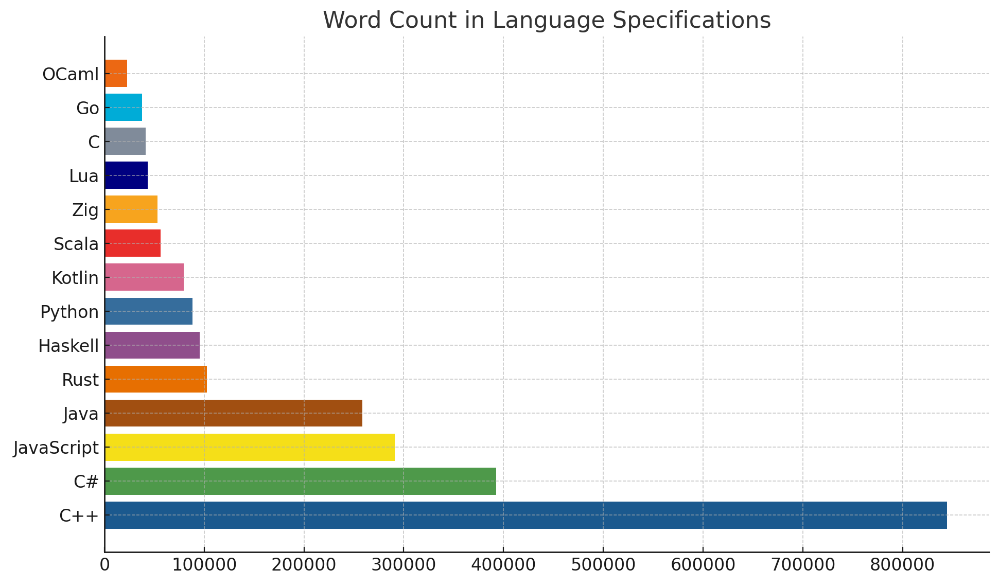

<style>
.split {
  display: table;
  width: 100%;
}
.split-item {
  display: table-cell;
  padding: 0px;
  width: 50%;
}
.split-left {
  position: relative;
}
.split-left__inner {
  height: 100%;
  position: fixed;
  width: 50%;
}
.split-right {
  position: relative;
}
.split-right__inner {
  height: 420px;
}
</style>

## いつ OCaml を始めたって良い

yuki @lmdexpr
2025-05-30

---

<!-- header: "いつ OCaml を始めたって良い @lmdexpr" --->
## 自己紹介

- Yuki Tajiri (@lmdexpr)
- 2025-02 より M3 基盤チームでソフトウェアエンジニア
- 6月14日〜6月15日に開催予定の「関数型まつり 2025」で僕と握手！
- Software Design で「つまみぐい関数型プログラミング」連載中
- エルデンリング ナイトレイン発売おめでとう！

---

λ Kansai in Winter 2025 というイベントで
<b>「OCaml を始めるには時期が良い」</b>
という発表をしました。(入社前)


実際、当時 (2025-01) は良いアップデートがあり、
時期が良かったです。

---

でも、別にいつ始めたっていい

---

ので、単純に好きなところを話します。

---

私が OCaml の好きなところ発表ドラゴンです。

---

## ここが好きだよ OCaml

<div class="split">
  <div class="split-item split-left">
    <div class="split-left__inner">
      <ul>
        <li>仕様が少ない</li>
        <li>それなりに速い</li>
        <li>パターンマッチがある</li>
        <li>型が強い</li>
        <li>型推論がほぼ完全</li>
        <li>正格評価</li>
        <li>非純粋</li>
      </ul>
    </div>
  </div>
  <div class="split-item split-right">
    <div class="split-right__inner">
    <ul>
      <li>デフォルト不変</li>
      <li>shadowing 文化</li>
      <li>モジュールシステム</li>
      <li>並列並行プリミティブ</li>
      <li>Algebraic Effects and Handlers</li>
    </ul>
    </div>
  </div>
</div>

---

## 仕様が少ない
言語仕様がシンプルで予約語も少ない



参考元: https://x.com/kai_fall/status/1882798641863377229

---

## それなりに速い

- ネイティブコンパイルで高速実行
- GCが優秀で、OCaml5 から更に高速化された
- 末尾最適はもちろん TRMC にも対応している

---

## それなりに速い

```ocaml
(* https://github.com/ocaml/ocaml/blob/trunk/stdlib/list.ml#L82-L90 
 * tail recursion mod cons (TRMC) 最適化
 *)
let[@tail_mod_cons] rec map f = function
    [] -> []
  | [a1] ->
      let r1 = f a1 in
      [r1]
  | a1::a2::l ->
      let r1 = f a1 in
      let r2 = f a2 in
      r1::r2::map f l
```

---

## パターンマッチがある

- 代数的データ型との組み合わせが強力
- 網羅性チェックで安全
- ネストしたパターンも書ける
- ガード条件も使える

---

## パターンマッチがある
```ocaml
type tree = Leaf of int | Node of tree * tree

let rec sum = function
  | Leaf n             -> n
  | Node (left, right) -> sum left + sum right

let classify n = match n with
  | x when x > 0 -> "positive"
  | 0            -> "zero"
  | _            -> "negative"
```

---

## 型が強い

- 静的型付けで実行時エラーを防ぐ
- null安全（option型）
- 代数的データ型で不正な状態を表現不可能にする
- 型安全

---

## 型が強い
```ocaml
type user = { name: string; age: int }

let find_user id = 
  if id <= 0 then None
  else 
    Some { name = "Alice"; age = 25 }

let greet = function
  | Some user -> "Hello, " ^ user.name
  | None      -> "User not found"
```

---

## 型推論がほぼ完全

- FYI 型推論が完全 ⇔ 正しいプログラムには必ず型付けすることができる
- 実際に OCaml を書く時は全く型を書かなくて良い
- Haskell や Scala, TS 辺りは闇に堕ちているので理論上完全性を保てない
  - 反面、OCaml では型レベルプログラミングとかは出来ません (HKT やら rank N types やらがない)

---

## 型推論がほぼ完全
```ocaml
(* 型注釈なしでも型が推論される *)
let map f lst = 
  let rec aux acc = function
    | [] -> List.rev acc
    | x :: xs -> aux (f x :: acc) xs
  in aux [] lst

(* val map : ('a -> 'b) -> 'a list -> 'b list *)
```

---

## 正格評価

- thunk を使って遅延評価もできる
- 同様にして Stream の実装なんかもある
- 基本的に正格評価、やりたい時は遅延、の方が感覚的には好き

---

## 正格評価
> The IO Monad is an ugly and furry byproduct of fighting between the beautiful pass-by-name purely mathematical semantics of Haskell and the ugly real world.
> ...
> However, the most important part is that we were able to implement the IO monad using pure OCaml, while it is impossible to implement the IO Monad in Haskel.

出典: https://discuss.ocaml.org/t/io-monad-for-ocaml/4618/11?u=lmdexpr

---

## 非純粋

- 必要に応じて副作用を使える
- I/Oが自然に書ける
- 既存のライブラリとの連携が楽
- 実用的なプログラムが書きやすい

---

## 非純粋
```ocaml
(* File I/O *)
let read_file filename =
  let ic = open_in filename in
  Fun.protect ~finally:(fun () -> close_in ic) @@ fun () ->
  In_channel.input_all ic

(* 参照 *)
let counter = ref 0
let () =
  incr counter (* !counter = 1 *)
```

---

## デフォルト不変

- 参照を使ったり、mutable指定しない限りは不変
- 説明するまでもない、ですよね？
- (弊記事第二回で説明しています)

---

## shadowing 文化

- 同じ名前の変数を再定義できる
- 関数型プログラミングのイディオム
- 段階的な値の変換を表現しやすい
- Haskeller には嫌われている

---

## shadowing 文化
```ocaml
let process_data data =
  let data = String.trim data in
  let data = String.lowercase_ascii data in
  let data = String.split_on_char ',' data in
  List.map String.trim data
```

---

## モジュールシステム

- ファーストクラスモジュール
- ファンクター（モジュールの関数）
- `local open`や`include`が個人的に使いやすい

---

## モジュールシステム
```ocaml
module NaiveSet = struct
  module Make(Ord : sig
    type t
    val compare : t -> t -> int
  end) = struct
    type t = Ord.t list
    let empty = []
    let add x s = List.sort_uniq Ord.compare (x :: s)
  end
end
module IntNaiveSet = NaiveSet.Make(struct
  type t = int
  let compare = Int.compare
end)
let s = IntNaiveSet.(empty |> add 1 |> add 2)
```

---

<style scoped >
p {
  font-size: 0.7em;
}
pre code {
  font-size: 0.6em;
}
</style>
## 並列並行プリミティブ

(なぜか公式サイトのプレイグラウンドのデフォルトコードがこれ)

```ocaml
let num_domains = 2
let n = 20

let rec fib n =
  if n < 2 then 1
  else fib (n-1) + fib (n-2)

let rec fib_par n d =
  if d <= 1 then fib n
  else
    let a = fib_par (n-1) (d-1) in
    let b = Domain.spawn (fun _ -> fib_par (n-2) (d-1)) in
    a + Domain.join b

let () =
  let res = fib_par n num_domains in
  Printf.printf "fib(%d) = %d\n" n res
```

出典: https://ocaml.org/play

---

## Algebraic Effects and Handlers

- 並列並行と同時に導入
- 限定継続が取れる例外
- async/await を実装したりできる
- 型がまだ未実装なのがちょっと辛い。。。

---

## Algebraic Effects and Handlers
```ocaml
effect Yield : int -> unit

let producer () =
  for i = 1 to 5 do
    perform (Yield i)
  done

let consumer () =
  match producer () with
  | ()                 -> print_endline "done"
  | effect (Yield n) k ->
      Printf.printf "got %d\n" n;
      continue k ()
```

---

OCaml 始めてくれ頼む！

---

今回のオチ

---

## ここがだめだよOCaml

- 流行ってない
- 標準ライブラリが控えめに言ってゴミ
  - 最近はかなり頑張っているので良い。
- 流行ってない
- エコシステムが発展途上
  - 昔と比べると天国。ロードマップも公開されている。
- 流行ってない
- マジで流行ってない
- もはや誰も知らない

---

OCaml 始めてくれ頼む！
