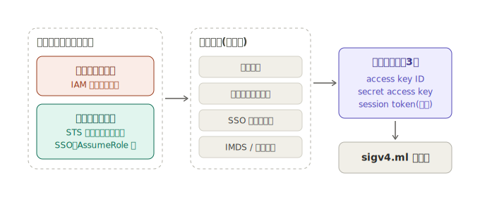

## OCamlで作ったアプリを実運用するためにライブラリを作っている

yuki @lmdexpr
2026-06-13

---

<!-- header: "OCamlで作ったアプリを実運用するためにライブラリを作っている @lmdexpr" --->
## 自己紹介

- Yuki Tajiri (@lmdexpr)
- M3 基盤開発チームで OCaml を書いている
- 関数型まつりで「OCamlで作ったアプリを実運用している」という発表予定
- OCaml Meeting 2026 in Tokyo の言い出しっぺ
- フロカン関西で「ReScriptで作ったアプリを実運用している」の CFP 出してます

---

## 今日のあらすじ

- sigv4.ml という OCaml ライブラリを作りました
- 純粋関数とエフェクトで設計する話
- 実は、会社で使ってますという話

---

皆さん、AWS 使ってますか？

---

AWS の API は、

**全リクエストに署名が必要**

です。

---

その署名方式が

**AWS Signature Version 4**

通称 **SigV4** です。

---

## SigV4 とは

1. リクエストを正規化して SHA256 でハッシュ
2. 日付・リージョン・サービス名から署名鍵を導出
3. HMAC-SHA256 で署名して `Authorization` ヘッダへ

普段は SDK が勝手にやってくれるので
意識することはありません。

---

ところで、

AWS 公式 SDK に OCaml は**ありません**。

---

そうですか。

---

## 作りました

**sigv4.ml**
https://github.com/lmdexpr/sigv4.ml

- SigV4 (header-based signing) の OCaml 実装
- コアの依存を極力減らした(依存は`uri`,`digestif`だけ)
- effect handlers を活用

---

## 設計方針: 署名は純粋関数

- 時刻情報は外から注入
- 資格情報は呼び出し側が解決
- HTTP リクエストは送らない
  - 「足すべきヘッダのリスト」を返すだけ

---

```ocaml
Sigv4.sign
  ~now:Unix.time
  ~credentials
  ~region:"us-east-1"
  ~service:"dynamodb"
  ~http_method:"POST"
  ~payload:body
  ~uri:(Uri.of_string "https://dynamodb.us-east-1.amazonaws.com/")
  [ "Host", "dynamodb.us-east-1.amazonaws.com";
    "Content-Type", "application/x-amz-json-1.0";
    "X-Amz-Target", "DynamoDB_20120810.PutItem" ]
(* => [ "Authorization", "AWS4-HMAC-SHA256 ...";
        "X-Amz-Date", "20260613T000000Z"; ... ] *)
```

---

ところで、

---

普段 AWS の認証情報ってどうやって使ってますか？

---



---

これをどう注入するか？

---

そうですね。

**Algebraic Effects and Handlers** ですね。

---

```ocaml
module Credentials = struct
  type t (* 抽象型 *)
  type _ Effect.t += Fetch : t Effect.t

  let fetch () = Effect.perform Fetch
end

let with_provider provider k =
  try k ()
  with effect Credentials.Fetch, k ->
    match Provider.run provider with
    | Ok creds     -> continue k creds
    | Error reason -> discontinue k @@ No_credentials reason
```

---

## 使う側

```ocaml
Sigv4.with_provider
  (Sigv4.Provider.chain
     [ Sigv4.Provider.Env.make ();
       Sigv4.Provider.Static.make
         ~access_key:"AKIDEXAMPLE" ~secret_key:"..." () ])
@@ fun () ->
let credentials = Sigv4.Credentials.fetch () in
Sigv4.sign ~now ~credentials (* ... *)
```

---

## 使う側 (ECS 対応)

```ocaml
let now () = Eio.Time.now clock in
Sigv4_cohttp_eio.run ~now ~client @@ fun () ->
  let credentials = Sigv4.Credentials.fetch () in
  Sigv4.sign ~now ~credentials (* ... *)
```

---

## ちゃんと動くの？

- AWS 公式のテストスイート(awslabs/aws-c-auth)準拠
- **38 fixtures、全部パス**

---

## まだ無いもの

- Pre-signed URL (query-string signing)
- `UNSIGNED-PAYLOAD` / streaming payload
- SigV4a
- opam リポジトリへの公開 (今は pin で使えます)

PR お待ちしております。

---

## エフェクト実際どうなの

- 差し替え (DI) とかは結構良い
- ライブラリ作ったり、layered architecture する時は結構便利
- ただ、どうしても「例外の辛さ」がある
- 実務で使うならコード規約は必要そう

---

ここまでが**趣味**の話。

---

ここからが**仕事**の話。

---

**会社 (エムスリー) で使ってます。**

---

OCaml が production で AWS に
リクエストを投げています。

---

「どこでどう使ってるの？」

---

続きは「関数型まつり」で！

---

と、言いつつも少しだけ宣伝がてらチラ見せします

---

## カジュアル面談の日程調整


(当日はここに link)

このページ、OCaml + ReScript で動いてます。

※ カジュアル面談に出てくるのは私ではなく VPoE です

---

試しに使ってみても

(カジュアル面談申し込んでもらっても)

いいですよ

---

## 今回のオチ

https://github.com/mbacarella/ocaml-awso

sigv4.ml 公開するかーと準備していたその日にいい感じの AWS ライブラリが出てたので今ならこっちがおすすめです。
